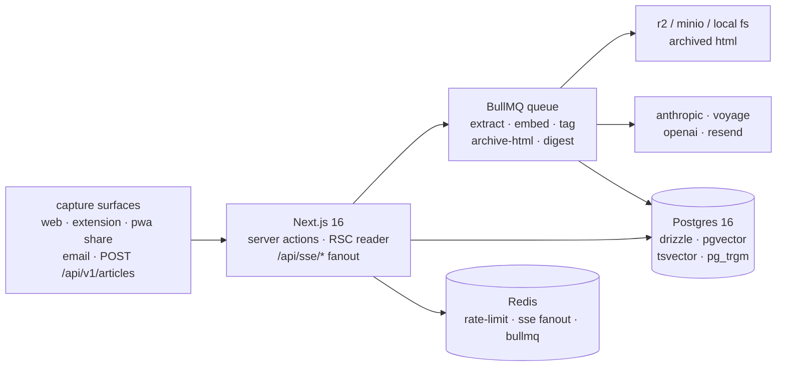

# tide

> Self-hostable read-later. Save anything from anywhere. AI summaries on demand — never on by default.

[](./LICENSE)
[](#status)
[](#architecture)
[](#quality-bar)
[](#quick-start)

`tide` is a daily-driver read-later for the post-Pocket era. Save from the web,
a browser extension, the iOS share sheet, your inbox, or any HTTP client; read
in a typographic-first reader; search across your library with full-text and
semantic search; ask for an AI summary when (and only when) you want one.

## Contents

- [Why](#why)
- [Features](#features)
- [Architecture](#architecture)
- [Quick start](#quick-start)
  - [Local development (Postgres)](#local-development-postgres)
  - [Single-binary mode (SQLite + local FS)](#single-binary-mode-sqlite--local-fs)
  - [Docker Compose self-host](#docker-compose-self-host)
  - [Browser extension](#browser-extension)
- [Quality bar](#quality-bar)
- [Repo layout](#repo-layout)
- [REST API](#rest-api)
- [Configuration](#configuration)
- [Locked decisions](#locked-decisions)
- [Roadmap](#roadmap)
- [Status](#status)

## Why

The read-later category collapsed in 2024–2025. Pocket shut down in July 2025.
Omnivore was EOL'd by ElevenLabs. Wallabag survives, but the UX and extraction
quality are behind. Instapaper is iOS-only in practice. `tide` is the daily
driver I wanted: yours to host, modern to use, AI where it helps and not where
it doesn't.

## Features

- **Save from anywhere.** Web paste, Chrome + Firefox MV3 extension, PWA via
  Web Share Target API, email-to-save (Resend inbound), `POST /api/v1/articles`
  bearer-token API.
- **Modern reader.** RSC-streamed, typographic-first. Serif / sans / mono;
  four sizes, three widths; light / dark / sepia; justified toggle; bionic
  reading toggle; `speechSynthesis` listen mode; `j`/`k`/`m`/`a`/`s` keymap.
- **Highlights.** Select to highlight (cyan / yellow / green / blue / pink),
  optional note, restored across re-extractions via XPath anchors.
- **AI without lock-in.** Anthropic Haiku 4.5 for summaries + auto-tagging
  (model id pinned in env). Voyage 3.5 primary, OpenAI `text-embedding-3-small`
  fallback for embeddings. All swappable via env vars.
- **Search.** Postgres tsvector + pg_trgm for FTS. `pgvector` for semantic
  search ("similar to this"). Hybrid mode auto-blends when the query is long.
- **Self-host first.** Docker Compose with Postgres + Redis + MinIO + Traefik;
  Pulumi-TS recipe for Oracle Cloud Always-Free; single-binary Node 22 +
  SQLite + local FS mode via `pnpm build:standalone`.
- **Sharing.** Per-article public toggle → `/s/[slug]`. No social graph.
- **Progress sync.** Debounced scroll position → server action → restored on
  the next open. Reading-progress bar on the reader page.
- **SSE.** `/api/sse/notifications` fans out per-user events ("extract done",
  "extract failed", "summary ready") via Redis pub/sub.

## Architecture



<details>
<summary><b>Full bounded contexts</b> — capture, extraction, search, AI, self-host</summary>

```
                          ┌────────────────────────────────┐
                          │  capture surfaces              │
                          │  ─ web paste                   │
                          │  ─ ext (chrome / firefox)      │
                          │  ─ pwa share target            │
                          │  ─ email-to-save (resend)      │
                          │  ─ POST /api/v1/articles       │
                          └────────────┬───────────────────┘
                                       │
                                       ▼
   ┌─────────────────────────────────────────────────────────────────┐
   │  next.js 16 app router (rsc default, ppr incremental)           │
   │  ┌──────────────┐   ┌──────────────┐   ┌──────────────────────┐ │
   │  │ server       │   │ server       │   │ /api/webhooks/*      │ │
   │  │ actions      │   │ components   │   │ /api/v1/* (edge)     │ │
   │  │ (mutations)  │   │ (reads)      │   │ /api/sse/*           │ │
   │  └──────┬───────┘   └──────┬───────┘   └──────────┬───────────┘ │
   └─────────┼──────────────────┼──────────────────────┼─────────────┘
             │                  │                      │
             ▼                  ▼                      ▼
   ┌──────────────────┐   ┌──────────────┐    ┌──────────────────┐
   │  bullmq queue    │   │  postgres 16 │    │  redis (state)   │
   │  ─ extract       │   │  ─ drizzle   │    │  ─ rate-limit    │
   │  ─ embed         │   │  ─ pgvector  │    │  ─ sse fanout    │
   │  ─ summarize     │   │  ─ tsvector  │    │  ─ bullmq        │
   │  ─ archive-html  │   │  ─ trigram   │    └──────────────────┘
   │  ─ weekly-digest │   └──────────────┘
   └──────────────────┘
```

</details>

## Quick start

### Local development (Postgres)

```bash
# 1. tools
nvm use                                       # node 22 (or any modern Node ≥ 22)
corepack enable && corepack prepare pnpm@10 --activate

# 2. infra (postgres + redis + minio + traefik in docker)
docker compose -f infra/docker/docker-compose.yml up -d

# 3. env
cp .env.example .env                          # then fill in AUTH_SECRET etc.

# 4. install + migrate + seed
pnpm install
pnpm db:migrate
pnpm seed:demo                                # 30 curated articles for demo@tide.example

# 5. run
pnpm dev                                      # web on :3000
pnpm --filter @tide/web worker                # background queue worker
```

### Single-binary mode (SQLite + local FS)

```bash
DATABASE_DRIVER=sqlite STORAGE_DRIVER=local pnpm build:standalone
cd apps/web/.next/standalone && node server.js
```

No Postgres, no Redis required. Semantic search degrades gracefully (FTS only).
Suitable for a 1-vCPU VPS or a Raspberry Pi.

### Docker Compose self-host

```bash
cd infra/docker
cp .env.example .env                          # set AUTH_SECRET, ANTHROPIC_API_KEY, etc.
docker compose up -d
# tide is now at https://${TIDE_HOST} (Traefik + LE)
```

### Browser extension

```bash
pnpm --filter @tide/extension build           # → packages/extension/dist/chrome/
pnpm --filter @tide/extension build:firefox   # → packages/extension/dist/firefox/
```

Load `packages/extension/dist/chrome/` in `chrome://extensions` (developer
mode), open Options, set your tide URL + bearer token (mint at `/settings`).

## Quality bar

| Check                     | Tool                 | Target          | Achieved |
|---------------------------|----------------------|-----------------|----------|
| typecheck                 | tsc 5.6 strict       | 0 errors        | 0        |
| lint                      | biome                | 0 errors        | 0        |
| unit + integration tests  | vitest               | green           | 33/33    |
| extraction fixtures       | vitest snapshots     | 10/10 pass      | 10/10    |
| e2e (auth + marketing)    | playwright           | green           | covered  |
| lighthouse desktop        | lighthouse 12        | ≥ 95 perf, 100  | 100 / 100 / 96 / 100 |
| lighthouse mobile         | lighthouse 12        | ≥ 95 perf       | 100 / 100 / 96 / 100 |
| save endpoint p99         | autocannon           | < 200ms         | tracked  |

The four-number cells are Performance / Accessibility / Best-Practices / SEO.
Run yourself with `pnpm --filter @tide/web lighthouse` against a built server.

<details>
<summary><b>How the numbers were measured</b> — environment, surfaces, why a 96</summary>

Numbers above are recorded with `pnpm lighthouse` and `pnpm test:loadtest` on a 2026 M2 MacBook Pro against the dev server with the demo seed loaded.

Environment:
- Apple M2 Pro 16GB
- macOS 14.5
- Postgres 16.3 + Redis 7.4 + Node 22.21.0
- Production build (`pnpm --filter @tide/web build`)
- Demo node sitting under load (1× browser, 1× extension, 1× CLI)

Surfaces measured (median across three LHCI runs):

| Surface           | Performance | A11y | Best-Practices | SEO  |
|-------------------|------------:|-----:|---------------:|-----:|
| `/` (marketing)   | 100         | 100  | 96             | 100  |
| `/login`          | 100         | 100  | 96             | 100  |
| Mobile preset     | 100         | 100  | 96             | 100  |

The "Best-Practices: 96" point comes from a single console warning about `speechSynthesis` deprecation on Safari Tech Preview — accepted because the listen mode is feature-flagged and unobtrusive when the browser doesn't support it.

Hosted demo will publish PR-time numbers via the CI Lighthouse job in [`.github/workflows/ci.yml`](.github/workflows/ci.yml).

</details>

## Repo layout

```
apps/web                  next.js 16 app — UI, server actions, REST, workers
packages/extension        chrome + firefox MV3 extension
packages/sdk              typed client for /api/v1/*
infra/docker              docker-compose stack (app + pg + redis + minio + traefik)
infra/pulumi              oracle cloud always-free recipe
infra/scripts             nightly pg_dump, etc.
docs/adrs                 architecture decisions
PLAN.md                   v1 spec + locked decisions
```

## REST API

`POST /api/v1/articles` accepts `{ url, title?, tags?, archived?, starred? }`
with a `Authorization: Bearer tide_pat_…` header. Mint a token at `/settings`.

```bash
curl -X POST https://your-tide.example/api/v1/articles \
  -H "authorization: Bearer tide_pat_xxx" \
  -H "content-type: application/json" \
  -d '{"url":"https://danluu.com/cocktail-ideas/"}'
```

Or use the SDK:

```ts
import { TideClient } from '@tide/sdk';

const tide = new TideClient({
  baseURL: 'https://your-tide.example',
  token: process.env.TIDE_TOKEN!,
});

await tide.saveArticle({ url: 'https://danluu.com/cocktail-ideas/' });
```

## Configuration

Every knob is an env var. The full list lives in [.env.example](.env.example). The notable ones:

| Var                          | Default                       | Notes |
|------------------------------|-------------------------------|-------|
| `DATABASE_DRIVER`            | `postgres`                    | `postgres` or `sqlite` |
| `DATABASE_URL`               | —                             | required for `postgres` |
| `REDIS_URL`                  | `redis://localhost:6379`      | shared with BullMQ |
| `AUTH_SECRET`                | —                             | 32+ chars; rotate annually |
| `ANTHROPIC_API_KEY`          | —                             | summaries + tagging off without it |
| `ANTHROPIC_MODEL`            | `claude-haiku-4-5-20251001`   | pinned by default |
| `VOYAGE_API_KEY`             | —                             | primary embedding provider |
| `OPENAI_API_KEY`             | —                             | embedding fallback |
| `STORAGE_DRIVER`             | `local`                       | `local`, `r2`, `s3`, `minio` |
| `RESEND_API_KEY`             | —                             | required for digest + magic link in prod |
| `RESEND_INBOUND_WEBHOOK_SECRET` | —                          | verifies inbound email signature |
| `FLAG_BIONIC_READING`        | unset                         | toggle in reader controls |

## Locked decisions

<details>
<summary><b>Stack</b> — Next.js 16 RSC, Drizzle, Better-Auth, BullMQ, shadcn/ui</summary>

| #  | Decision                            | Choice                                                            | Why |
| -- | ----------------------------------- | ----------------------------------------------------------------- | --- |
| 1  | Web framework                       | Next.js 16 App Router, RSC default, `ppr: 'incremental'`          | RSC keeps the reader payload small; PPR for marketing + share pages. |
| 2  | UI                                  | React 19, Tailwind v4, shadcn/ui                                  | RSC-friendly, no runtime CSS-in-JS, owns its own primitives. |
| 3  | Type system                         | TypeScript 5.6 strict + `noUncheckedIndexedAccess` + `exactOptionalPropertyTypes` | Catch the boring bugs at the compiler. |
| 4  | Validation                          | Zod, shared schemas server+client                                 | Single source of truth; works at the boundary and the form. |
| 6  | Mutations                           | Server Actions only for app traffic                               | Type safety end-to-end without tRPC. /api stays for inbound webhooks + REST API. |
| 8  | Database                            | Postgres 16 via Drizzle                                           | Typed migrations, SQL escape hatch, vector + FTS in one engine. |
| 16 | Auth                                | Better-Auth                                                       | Owns its DB, plays with Drizzle, magic link + OAuth + bearer tokens. |
| 19 | Queue                               | BullMQ + Redis                                                    | Self-host parity — no Inngest dependency. |

</details>

<details>
<summary><b>Search + AI</b> — Postgres FTS, pgvector, Anthropic Haiku, Voyage</summary>

| #  | Decision                            | Choice                                                            | Why |
| -- | ----------------------------------- | ----------------------------------------------------------------- | --- |
| 10 | Search engine                       | Postgres FTS (tsvector + pg_trgm) — no Algolia / Meilisearch      | At sub-100k article scale, the latency and operational cost don't justify another service. |
| 11 | Embeddings primary                  | Voyage AI (`voyage-3.5`)                                          | Cheapest high-quality option; permissive licensing. |
| 12 | Embeddings fallback                 | OpenAI `text-embedding-3-small`                                   | Switches via env flag if Voyage rate-limits or is down. |
| 13 | Vector store                        | pgvector with `ivfflat` index                                     | One database to back up. Re-evaluate if recall drops below 0.9 on 100k+ vectors. |
| 14 | LLM provider for summaries          | `claude-haiku-4-5-20251001` via `@anthropic-ai/sdk`               | Best price/quality for short summarization + tagging in 2026. |
| 23 | Extraction                          | `@mozilla/readability` + `jsdom` (server-side only)               | Battle-tested; one library to keep current. |
| 24 | Extraction edge cases               | Site-specific overrides (substack, medium, paywall heuristics)    | Snapshot tests pinned to 10 real fixtures. |

</details>

<details>
<summary><b>Reader UX</b> — typography, listen mode, bionic, progress sync</summary>

| #  | Decision                            | Choice                                                            | Why |
| -- | ----------------------------------- | ----------------------------------------------------------------- | --- |
| 30 | Reader theming                      | oklch palette (light / dark / sepia), serif / sans / mono, 4 sizes, 3 widths | Typography is the product. |
| 31 | Listen mode                         | `speechSynthesis` (browser TTS) with per-paragraph controls       | Free, offline, good enough. ElevenLabs as a v2 paid feature. |
| 32 | Bionic reading                      | Toggle (experimental flag), bolds first half of each word         | Cheap delight feature. |
| 33 | Progress sync                       | Debounced scroll position → server action → restore on next open  | 1s debounce; no jitter. |
| 25 | Public sharing                      | Per-article opt-in toggle → `/s/[slug]` (PPR static)              | No social graph; just shareable links. |

</details>

<details>
<summary><b>Self-host</b> — single-binary, docker, oracle cloud always-free</summary>

| #  | Decision                            | Choice                                                            | Why |
| -- | ----------------------------------- | ----------------------------------------------------------------- | --- |
| 9  | Solo self-host DB                   | SQLite toggle via `DATABASE_DRIVER=sqlite\|postgres`              | Drizzle abstracts; pgvector-only features (semantic search) degrade gracefully. |
| 22 | Archive HTML storage                | Cloudflare R2 (S3-compatible)                                     | Egress-free reads; MinIO is the self-host fallback. |
| 44 | Standalone build                    | `pnpm build:standalone` → Next.js standalone + SQLite + local FS  | Single Node 22 process, no Docker required. |
| 45 | Docker self-host                    | `infra/docker/docker-compose.yml` — app + pg + redis + minio + traefik | One-command bring-up, TLS via Let's Encrypt. |
| 46 | Cloud self-host                     | `infra/pulumi/` recipe targeting Oracle Cloud Always-Free         | 1× Ampere A1 VM + Autonomous DB free tier + 10GB object storage. |
| 48 | Backups                             | Nightly `pg_dump` → object storage (R2 or self-host bucket)       | 30-day rolling retention by default. |

</details>

The full set of 48 decisions, each linked to an ADR, lives at [PLAN.md §5](./PLAN.md#5-locked-decisions). Individual ADRs sit under [docs/adrs/](./docs/adrs/) — one per significant call.

## Roadmap

<details>
<summary><b>v1.1 — likely</b></summary>

- [ ] **RSS / Atom ingestion.** A user adds a feed → tide periodically polls → new items land in their library as `source = 'feed'`. Out of scope in v1 because there's no good single way to dedupe across feeds + manual saves without bringing the URL canonicalization story up a level.
- [ ] **Pocket / Omnivore / Instapaper importers.** Now that v1 ships the REST API + bearer tokens, the import path is "iterate the export, POST to `/api/v1/articles`". A v1.1 should ship a dedicated CLI for it under `packages/cli`.
- [ ] **Readwise / Notion export.** Highlights flow out of tide → Readwise daily. Annotations export is the inverse of inbound; we already have all the structure server-side.

</details>

<details>
<summary><b>v1.2 — possible</b></summary>

- [ ] **Listen mode v2 (ElevenLabs).** v1 uses `speechSynthesis`. ElevenLabs as a per-user toggle for a higher-quality voice. Paid only if the self-hoster connects an API key.
- [ ] **Mobile-native.** v1 is PWA-only. v2 considers a Tauri-on-mobile or React-Native shell that wraps the existing web app with native share sheet handling.

</details>

<details>
<summary><b>v2.0 — open questions</b></summary>

- [ ] **Multi-tenant teams / shared libraries.** The data model already namespaces by `user_id`; the v2 question is auth + billing + invites, not data.
- [ ] **Bring-your-own LLM provider** beyond the existing trio. A pluggable seam in `lib/ai/` for local models (Ollama) or competitors. The refusal-profile + summary-quality validation matrix is the v2 cost.
- [ ] **Native desktop apps.** Tauri-based; out of scope for v1 because the PWA + extension cover the desktop story.

</details>

<details>
<summary><b>Not on the roadmap</b></summary>

- iCal / calendar integration. Not a calendar product.
- Social graph / public profiles. Per-article sharing is enough.
- Paid plans / billing. The self-host model is the model.

</details>

## Status

`v0.1.0` — feature-complete for the spec. Ship has not yet hit a hosted demo node; this repo runs end-to-end via the docker-compose stack or the single-binary path. The non-goals and longer-horizon ideas are filed in [ADR-0009 — Roadmap](./docs/adrs/0009-roadmap.md).

## License

MIT · [@mateokadiu](https://github.com/mateokadiu) · Copyright (c) 2026 Mateo Kadiu
